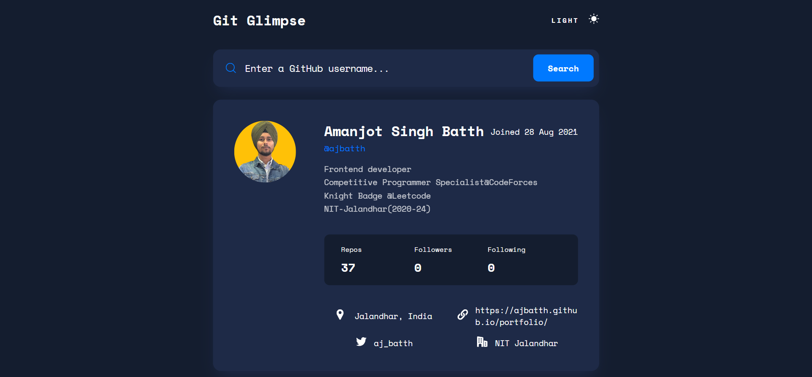

# GitGlimpse

This is a web application that allows users to retrieve information about GitHub users by entering their GitHub username. The app provides details such as the user's name, avatar, bio, number of followers, number of followings, number of repositories, location, Twitter profile, and portfolio link.

## Features

- Search bar: Users can enter a GitHub username in the search bar to retrieve information.
- User Information Display: The app displays the retrieved information about the user, including their name, avatar, bio, followers, followings, number of repositories, location, Twitter profile, and portfolio link.
- Responsive Design: The app is designed to be responsive and provides optimal user experience on various devices. Media queries have been added to ensure proper display on tablets and desktops.
- Dark and Light Mode: Users can switch between dark and light mode themes based on their preference.

## Technologies Used

- HTML
- CSS
- JavaScript

## Getting Started

To run the GitHub User Info Web App locally, follow these steps:

1. Clone the repository: `git clone https://github.com/ajbatth/GitGlimpse.git`
2. Navigate to the project directory: `cd GitGlipmse`
3. Open the `index.html` file in your preferred web browser.

## Usage

1. Open the GitHub User Info Web App in your web browser.
2. Enter a GitHub username in the search bar.
3. Click the "Search" button or press "Enter".
4. The app will display the retrieved information about the user.

## Contributing

Contributions are welcome! If you would like to contribute to this project, please follow these steps:

1. Fork the repository.
2. Create a new branch: `git checkout -b my-new-feature`
3. Make your changes and commit them: `git commit -am 'Add some feature'`
4. Push the changes to your fork: `git push origin my-new-feature`
5. Submit a pull request.

## Acknowledgements

- The app utilizes the GitHub API to retrieve user information.

Feel free to customize this README file to include any additional information or sections that you find relevant.
